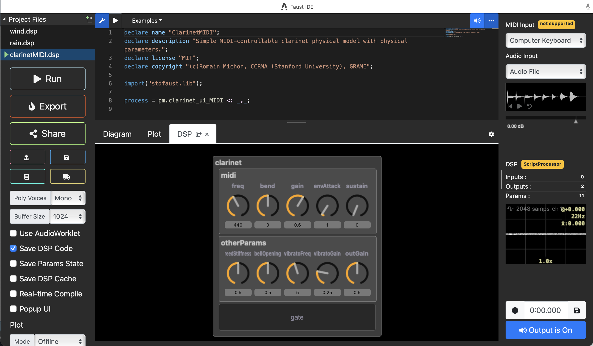

# Faust IDE [](https://996.icu/#/en_US)

The online [Faust IDE](https://faustide.grame.fr) can be used to _edit_, _compile_ and _run_ Faust code from any recent Web Browser with [webassembly](http://webassembly.org) support. It works completely on the client side and it is therefore very convenient for situations with many simultaneous users (workshops, classrooms, etc.). It embeds the latest version of the Faust compiler with an efficient webassembly backend and offers polyphonic MIDI support.



## Features

#### Code Editing
The editor engine is based on [Monaco Editor](https://microsoft.github.io/monaco-editor/). It provides _syntax highlighting_, _auto completion_, _code hinting_ and direct access to the _online documentation_. The documentation command (Ctrl-D) uses the function name at the cursor position to locate the relevant information.

#### Vim Mode Support
The Monaco Editor supports an optional mode for Vim users. To enable it, open the command pane (F1) and search for 'Toggle Vim Mode'. The same command is used to desactivate this functionality. Alternatively, you can right click on the editor and press 'Open Command Palette' to open the contextual menu.

#### Project Files
Several DSP files can be added in the top-left *Project Files* section and edited independently. Any non standard library, like a *foo.lib* file, can simply be added by drag/drop, then used in the DSP code with `import("foo.lib");`. 
DSP files or libraries can also be loaded or saved with the *Upload* and *Save As* buttons in the left column. 

#### Auto-Compiling
While the option is turned on, the diagram or the DSP UI will automatically be updated from the code. The editor will also try to tell if there is an error in your code.

#### MIDI input
MIDI Input is available for Chrome and Firefox browsers. You can also use the computer keyboard to input MIDI notes. We are using key map as Ablelon Live: A-line and Q-line for keys, ZX to move octave, CV to change velocity.

#### Polyphonic mode
The polyphonic mode can be activated by selecting a number of voices in the _Poly Voices_ menu on the left. [Standard Polyphony Parameters](https://faustdoc.grame.fr/manual/midi/#standard-polyphony-parameters) have to be used in the DSP voice.

A global effect can be added using the `effect = foo;` [convention](https://faustdoc.grame.fr/manual/midi/#audio-effects-and-polyphonic-synthesizer), possibly adapting the voice and effect inputs/outputs to make them compatible. 

#### Audio Input
You can choose your audio device or use an audio file to simulate the audio input of DSP. Drap and drop your file to the waveform below to substitute the file.

#### Audio Output
Audio output can be switched on/off using the he *Output is On/Output is Off* button on the bottom-right. 

#### Audio Recording
The generated sound can be recorded on the fly then possibly saved using the *Record/Save* section on the bottom-right. 

#### Remote compilation
The currently edited DSP program can be sent to the [remote compilation service](https://github.com/grame-cncm/faustservice) which allows to export for a large number of targets, like various standalone formats, a Max/MSP external on macOS or Windows, a SuperCollider UGen.etc. Use the *Truck* button on the left column to access the list of possible *Platform* and the list of associated *Architecture*. Select one *Platform/Architecture* pair and wait a bit until you get the compiled result as a binary zipped file.  
Note that some targets produce a source file (like *source/cplusplus*), or ready to be compiled projects (like *juce/plug-in* to create a [JUCE](https://juce.com) project).

#### Audio analyzers
Tools to display audio signals are available in the left panel:

- **Mode** can be _Offline_, _Continuous_, _On Event_ (to synchronize visualisation with control event changes), and _Manual_ (to be triggered with the _Plot (Snapshot)_ button at the bottom)

- **Samples** changes the number of displayed samples (so corresponding to the window width) 

- **Sample Rate** displays the currently selected audio device sample rate

- **FFT Size** and **FFT Overlap** value are used when using _Oscilloscope_ and _Spectroscope_ modes

In the _Plot_ Tab in the middle section, you can switch the visualization between _Data_, _Interleaved_, _Oscilloscope_ and _Spectroscope_. Note that when used with _On Event_ mode, values in the _Data_ visualisation mode only change at sample 128 (since _On Event_ mode plots from 128 samples before the event).

Both input and output have an audio analyzer in the right panel. In the small audio output window at the bottom, you can switch the visualization between _Oscilloscope_ and _Spectroscope_, or change buffer size and channel. Three numbers showing at right side are current value, estimated frequency and RMS.

In the display zone, zoom can be changed with *2 fingers up/down slide* on macOS from 1x up to 800x. 

#### SVG Diagrams
The _Diagram_ tab allows displaying the circuit SVG diagram. You can navigate inside it by clicking on the dark blue part to go down in the circuit hierarchy, or clicking on the diagram border to go up in the circuit hierarchy.

#### Soundfiles access

The [soundfile](https://faustdoc.grame.fr/manual/syntax/#soundfile-primitive) primitive can be used in the IDE. The audio files have to be accessed:

- by dropping all needed soundfiles in the *Project Files* section on the left, then directly accessing them in the DSP code 

- by using a full URL like https://raw.githubusercontent.com/grame-cncm/GameLAN/master/baliphone/Gamelan_1_1_C_gauche.flac

- by defining the soundfile base URL folder with the `declare soundfiles "https://raw.githubusercontent.com/grame-cncm/GameLAN/master/baliphone";` metadata, then the actual audio file name in the code. See this [example](https://github.com/grame-cncm/GameLAN/blob/master/baliphone/Baliphone.dsp). Several base URL can be listed with the `declare soundfiles "https://url1;https://url2;https://url3";` kind of syntax

To access local audio files, a local server can be started:

- use the local server URL `http://127.0.0.1:8000` (or `http:/localhost:8000`) with `declare soundfiles "http:/localhost:8000";`). Additional URLs can always be declared if needed. 

- install the required package with `pip install Flask Flask-CORS` (or `pip3 install Flask Flask-CORS`)

- create a folder *my_faust_server*. Inside create a text file *server.py* with the following code and a folder *static_files*. Place your audio files inside *static_files*.

```Python
from flask import Flask, send_from_directory, abort
from flask_cors import CORS
import os

app = Flask(__name__)

# Specify trusted origins
trusted_origins = os.getenv(
    "TRUSTED_ORIGINS", "http://localhost,http://127.0.0.1,https://faustide.grame.fr"
).split(",")

CORS(app, origins=trusted_origins)

# Serve files from a dedicated directory (e.g., "static_files")
STATIC_FILES_DIR = "static_files"
os.makedirs(STATIC_FILES_DIR, exist_ok=True)  # Ensure the directory exists

@app.route("/<path:filename>")
def download_file(filename):
    # Simple validation to prevent directory traversal
    if ".." in filename or filename.startswith("/"):
        abort(404)  # Not found for invalid paths
    return send_from_directory(STATIC_FILES_DIR, filename)

if __name__ == "__main__":
    app.run(debug=False, port=8001)  # Disable debug mode in production
```

- then launch the script with `python server.py`(or `python3 server.py`). 

Here are polyphonic [samplers examples](https://github.com/sletz/faust-sampler). 

## Recommended Browsers
The recommended browsers are the latest versions of Chrome and Firefox for AudioWorklet and MIDI, but it requires an https connection to use the audio inputs.

## Building

Firstly ensure that you have [Git](https://git-scm.com/downloads) and [Node.js](https://nodejs.org/) installed.

Clone a copy of the repo then change to the directory:

```bash
git clone https://github.com/grame-cncm/faustide.git --depth 1
cd faustide
```
Beware: on Windows, before cloning the repository, and for the libfaust-wasm.data file line ending to be correctly handled, you'll have to do:

```bash
git config --global core.autocrlf false
```

Install dev dependencies:

```bash
npm install
```

Possibly:

```bash
npm update
```

To build everything (using Webpack 4, Babel 7, TypeScript), this will produce `dist/index.js`
```bash
npm run build
```

To test, put the directory in a local server, then open page: `./dist/index.html`

If you need to update the editor's version using `git pull`, as the repository has other dependencies hosted on Github, you may run `npm update` to make sure everything is up to date.

## Launching the local editor

A local HTTP server has to be started with `npm run serve` (or something similar), then use `http://127.0.0.1:8000/dist/` to launch the local editor.

## Versioning

You'll have to raise the package version number in `package.json` before `npm run build` to properly work.

## Useful links

- [https://faustide.grame.fr](https://faustide.grame.fr): the official link on the Faust IDE website
- [https://github.com/grame-cncm/faustide](https://github.com/grame-cncm/faustide): the github repository

## Known problems and solutions

- evaluating a heavy DSP program may hang the IDE, which will stay in this state even if you open it again, if the **Real-time Compile** checkbox was set. You can deactivate the checkbox by opening the IDE with the `https://faustide.grame.fr/?realtime_compile=0` URL
- MIDI is only working in Chrome and Firefox
- the **ExpressVPN** browser extension runs a background loop when "Not Connected" which causes any instantiated FaustUI element to fail after a few seconds. Disabling the extension will solve this problem (not tested on Safari)
- some users report random problems when exporting the code, like missing labels when exporting on osx/coreaudio-qt. Clearing the browser's cache and cookies can fix the issue
