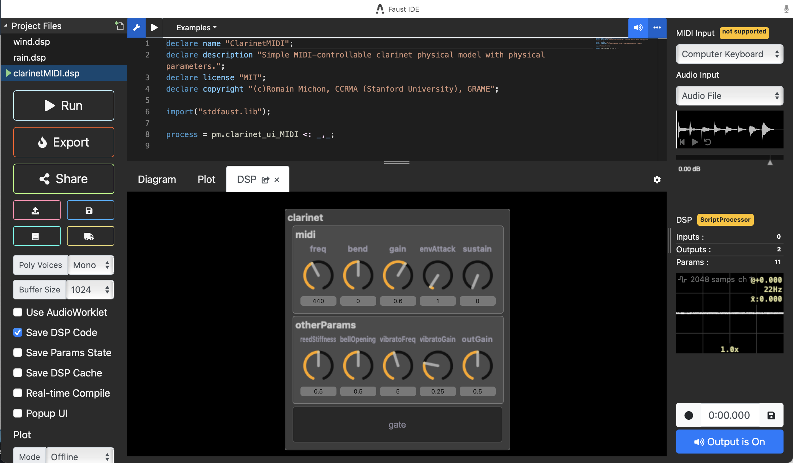

# Faust IDE [](https://996.icu/#/en_US)

The online [Faust IDE](https://faustide.grame.fr) can be used to _edit_, _compile_ and _run_ Faust code from any recent Web Browser with [webassembly](http://webassembly.org) support. It works completely on the client side and it is therefore very convenient for situations with many simultaneous users (workshops, classrooms, etc.). It embeds the latest version of the Faust compiler with an efficient webassembly backend and offers polyphonic MIDI support.



## Features

#### Code Editing

The editor engine is based on [Monaco Editor](https://microsoft.github.io/monaco-editor/). It provides _syntax highlighting_, _auto completion_, _code hinting_ and direct access to the _online documentation_. The documentation command (Ctrl-D) uses the function name at the cursor position to locate the relevant information.

#### Resetting parameters to their default value 

You can double-click knobs or sliders to reset them, or on the group label to reset all its children. 

#### Saving parameter state

Enable *Save Params State* to preserve DSP control values when running or
recompiling the program. The restored values are applied to the new DSP and
reflected in both the embedded Faust UI and an already-open Faust UI popup,
instead of those controls returning to their declared defaults.

#### Vim Mode Support

The Monaco Editor supports an optional mode for Vim users. To enable it, open the command pane (F1) and search for 'Toggle Vim Mode'. The same command is used to desactivate this functionality. Alternatively, you can right click on the editor and press 'Open Command Palette' to open the contextual menu.

#### Project Files

Several DSP files can be added in the top-left *Project Files* section and edited independently. Any non standard library, like a *foo.lib* file, can simply be added by drag/drop, then used in the DSP code with `import("foo.lib");`. 
DSP files or libraries can also be loaded or saved with the *Upload* and *Save As* buttons in the left column.

The project file list is stored in the browser, so files remain available after a reload. Drag/drop supports several files at once, both on the editor overlay and on the *Project Files* panel. Structural imports are saved immediately before the import finishes, so a reload right after a multi-file drop keeps the imported files.

On Chrome and other Chromium-based browsers, Faust IDE can also use the browser [File System Access API](https://developer.mozilla.org/en-US/docs/Web/API/File_System_API) to work with local folders:

- Use *Mount a disk folder...* to authorize a local folder. Mounted folders are remembered by the browser, although Chrome may ask for permission again after a reload or a browser restart.
- Use the eject button next to a mounted disk volume in the file browser to unmount it. Files already copied into the project stay available as local browser copies, but they stop writing back to the disk folder.
- Native Faust files (`.dsp` and `.lib`) opened or dropped from a mounted folder are edited *in place*: after the project copy is saved, changes are also written back to the original disk file.
- Faust IDE checks mounted files before writing them back to disk, before compiling the main file, when the tab regains focus, and periodically while the tab is visible. If another editor changed a mounted file and the Faust IDE copy is still clean, the disk version is reloaded automatically. If both Faust IDE and the disk file changed, Faust IDE blocks automatic write-back and shows conflict actions: reload from disk, overwrite disk, or keep a local copy.
- If a mounted file was deleted, moved, or no longer has browser permission, Faust IDE blocks compile/save for that file and asks the user to restore the file or re-authorize the mounted folder. Browser permission prompts still require an explicit user action; background polling only detects the problem.
- Disk-backed project files are shown in green in *Project Files*. A green row means Faust IDE knows the original mounted disk file and will write text edits back to it.
- White rows are local browser copies only. They are saved in the browser project storage but are not linked to a real disk file.
- Audio files and other non-Faust formats are imported as local copies, not opened in place.
- Opening or dropping the same mounted file more than once selects the existing green row instead of creating a duplicate `untitledN` file.
- If a local white file named `foo.dsp` already exists and you later open/drop a mounted disk file with the same name, Faust IDE keeps the local copy untouched and reports a conflict. Rename or delete the local copy before opening the mounted disk file if you want the disk-backed version.
- The remaining platform limitation is that browsers do not provide a true atomic compare-and-swap write for local files, so a file could still change in the very small interval between Faust IDE's final check and the browser write operation.

#### Auto-Compiling

While the option is turned on, the diagram or the DSP UI will automatically be updated from the code. The editor will also try to tell if there is an error in your code.

#### MIDI input

MIDI Input is available for Chrome and Firefox browsers. You can also use the computer keyboard to input MIDI notes. We are using key map as Ablelon Live: A-line and Q-line for keys, ZX to move octave, CV to change velocity.

#### Polyphonic mode

The polyphonic mode can be activated by selecting a number of voices in the _Poly Voices_ menu on the left. [Standard Polyphony Parameters](https://faustdoc.grame.fr/manual/midi/#standard-polyphony-parameters) have to be used in the DSP voice.

A global effect can be added using the `effect = foo;` [convention](https://faustdoc.grame.fr/manual/midi/#audio-effects-and-polyphonic-synthesizer), possibly adapting the voice and effect inputs/outputs to make them compatible. 

#### Audio Input
You can choose your audio device or use an audio file to simulate the audio input of DSP. Drap and drop your file to the waveform below to substitute the file.

#### Audio Output

Audio output can be switched on/off using the he *Output is On/Output is Off* button on the bottom-right. 

#### Audio Recording

The generated sound can be recorded on the fly then possibly saved using the *Record/Save* section on the bottom-right. 

#### Remote compilation

The currently edited DSP program can be sent to the [remote compilation service](https://github.com/grame-cncm/faustservice) which allows to export for a large number of targets, like various standalone formats, a Max/MSP external on macOS or Windows, a SuperCollider UGen.etc. Use the *Truck* button on the left column to access the list of possible *Platform* and the list of associated *Architecture*. Select one *Platform/Architecture* pair and wait a bit until you get the compiled result as a binary zipped file.  
Note that some targets produce a source file (like *source/cplusplus*), or ready to be compiled projects (like *juce/plug-in* to create a [JUCE](https://juce.com) project).

#### Audio analyzers

Tools to display audio signals are available in the left panel:

- **Mode** can be _Offline_, _Continuous_, _On Event_ (to synchronize visualisation with control event changes), and _Manual_ (to be triggered with the _Plot (Snapshot)_ button at the bottom)

- **Samples** changes the number of displayed samples (so corresponding to the window width) 

- **Sample Rate** displays the currently selected audio device sample rate

- **FFT Size** and **FFT Overlap** value are used when using _Oscilloscope_ and _Spectroscope_ modes

- **FFT Window** selects _Auto_, _None (Rectangular)_, _Hann (N/4)_, or _Blackman_ weighting. _Auto_ uses an unscaled rectangular FFT for offline plots, exactly like `numpy.fft.rfft`: a unit impulse produces a flat 0 dB magnitude and zero phase. Captured-signal modes use Blackman automatically. The optional Hann mode applies the symmetric Hann window and `N/4` scaling used by the reference Python plotter.

In the _Plot_ Tab in the middle section, you can switch the visualization between _Data_, _Interleaved_, _Oscilloscope_, _Spectroscope_, _Spectrogram_, and _Phase_. Changing the acquisition mode does not change the active visualization. Note that when used with _On Event_ mode, values in the _Data_ visualisation mode only change at sample 128 (since _On Event_ mode plots from 128 samples before the event).

The _Spectroscope_ view can display magnitude as dBFS or normalized linear
amplitude. In dBFS mode, the _Bottom_ and _Top_ number fields set the visible
magnitude range directly. The _Phase_ view displays wrapped phase in degrees.
Both magnitude and phase views support linear or logarithmic frequency axes
with ticks that follow the visible zoom range.

Waveform x-axis ticks are shown in seconds using the active audio sample rate. Drag across an offline waveform to select a range; its length is displayed in samples and seconds. With the plot canvas focused, copy (`Ctrl+C`/`Cmd+C`) places a CSV table containing sample index, time in seconds, and every channel value on the clipboard. Use _Alt-drag_ to pan a waveform without changing the selection.

Double-click the x- or y-axis gutter to reset only that axis to its default zoom. In _Data_ mode, sample indices fill each visible column from top to bottom before continuing in the next column.

Both input and output have an audio analyzer in the right panel. In the small audio output window at the bottom, you can switch the visualization between _Oscilloscope_ and _Spectroscope_, or change buffer size and channel. Three numbers showing at right side are current value, estimated frequency and RMS.

In the display zone, zoom can be changed with a wheel or two-finger vertical gesture. Horizontal trackpad gestures pan the visible window.

#### SVG Diagrams

The _Diagram_ tab allows displaying the circuit SVG diagram. You can navigate inside it by clicking on the dark blue part to go down in the circuit hierarchy, or clicking on the diagram border to go up in the circuit hierarchy.

#### Soundfiles access

The [soundfile](https://faustdoc.grame.fr/manual/syntax/#soundfile-primitive) primitive can be used in the IDE. Note that soundfile access may have to deal with the [CORS issue](https://en.wikipedia.org/wiki/Cross-origin_resource_sharing). 

The audio files have to be accessed:

- by dropping all needed soundfiles in the *Project Files* section on the left, then directly accessing them in the DSP code 

- by using a full URL like https://raw.githubusercontent.com/grame-cncm/GameLAN/master/baliphone/Gamelan_1_1_C_gauche.flac

- by defining the soundfile base URL folder with the `declare soundfiles "https://raw.githubusercontent.com/grame-cncm/GameLAN/master/baliphone";` metadata, then the actual audio file name in the code. See this [example](https://github.com/grame-cncm/GameLAN/blob/master/baliphone/baliphone.dsp). Several base URL can be listed with the `declare soundfiles "https://url1;https://url2;https://url3";` kind of syntax

- Soundfiles hosted on GitHub can also be accessed through the jsDelivr CDN, which provides CORS-enabled URLs, starting with https://cdn.jsdelivr.net/gh/. Therefore, the previous files can also be delivered using the following base URL: `declare soundfiles "https://cdn.jsdelivr.net/gh/grame-cncm/GameLAN/baliphone";`.

To access local audio files, a local server can be started:

- use the local server URL `http://127.0.0.1:8000` (or `http://localhost:8000`) with `declare soundfiles "http://localhost:8000";`). Additional URLs can always be declared if needed. 

- install the required package with `pip install Flask Flask-CORS` (or `pip3 install Flask Flask-CORS`)

- create a folder *my_faust_server*. Inside create a text file *server.py* with the following code and a folder *static_files*. Place your audio files inside *static_files*.

```Python
from flask import Flask, send_from_directory, abort
from flask_cors import CORS
import os

app = Flask(__name__)

# Specify trusted origins
trusted_origins = os.getenv(
    "TRUSTED_ORIGINS", "http://localhost,http://127.0.0.1,https://faustide.grame.fr"
).split(",")

CORS(app, origins=trusted_origins)

# Serve files from a dedicated directory (e.g., "static_files")
STATIC_FILES_DIR = "static_files"
os.makedirs(STATIC_FILES_DIR, exist_ok=True)  # Ensure the directory exists

@app.route("/<path:filename>")
def download_file(filename):
    # Simple validation to prevent directory traversal
    if ".." in filename or filename.startswith("/"):
        abort(404)  # Not found for invalid paths
    return send_from_directory(STATIC_FILES_DIR, filename)

if __name__ == "__main__":
    app.run(debug=False, port=8001)  # Disable debug mode in production
```

- then launch the script with `python server.py`(or `python3 server.py`). 

Here are polyphonic [samplers examples](https://github.com/sletz/faust-sampler). 

## Recommended Browsers
The recommended browsers are the latest versions of Chrome and Firefox for AudioWorklet and MIDI, but it requires an https connection to use the audio inputs.

## Building

Install [Git](https://git-scm.com/downloads) and Node.js 20.12 or newer in the
Node 20 release line, matching CI. npm is included with Node.js.

Clone a copy of the repo then change to the directory:

```bash
git clone https://github.com/grame-cncm/faustide.git
cd faustide
```

Beware: on Windows, before cloning the repository, and for the libfaust-wasm.data file line ending to be correctly handled, you'll have to do:

```bash
git config --global core.autocrlf false
```

Install the exact dependencies recorded in `package-lock.json`, build the
development bundle, and start the local server:

```bash
npm ci
npm run build
npm run serve
```

Open <http://127.0.0.1:8000/dist/>. The server does not rebuild or hot-reload
source files: after a source change, run `npm run build` again and reload the
browser. Keep the hostname consistent because browser storage is scoped to the
origin.

To exercise the optimized production-equivalent bundle locally:

```bash
npm run dist
npm run serve
```

If the server is already running, only reload the browser after `npm run dist`.
Do not change the version in `package.json` merely to run a local build.

Note that the `src/static/examples` folder is a manually copied subset of the `faust/examples` that will have to be updated from time to time. 

For validation commands, browser/audio caveats, production builds, and
troubleshooting, see the [local deployment guide](doc/local-deployment.md).

## Contributing

The TypeScript runtime is organized as a small composition root (`src/index.ts`)
plus layered modules: `model/` (project rules), `runtime/` (DOM-free services and
state), `ui/` (controllers/views), and `scope/` (analyser/plot widgets).

Quality bar for any contribution — keep the code **clean, well-tested, and
well-documented**:

- **Tests first.** Add a test that pins the current behavior before changing it,
  and keep the suite green at every commit. Bug fixes ship with a regression
  test. The setup is a three-layer pyramid: ESLint/Stylelint, Vitest (jsdom)
  unit/integration tests, and Playwright end-to-end tests against the built
  `dist/`.
- **Run the gate before committing:**

  ```bash
  npm test          # lint (eslint + stylelint)
  npm run test:unit # vitest
  npm run build
  # and, for browser-visible / bundle changes:
  npm run dist && npm run test:e2e
  ```

  CI runs the same gate (with coverage thresholds) on every push/PR; keep it
  green. Coverage thresholds are a ratchet — raise them as you add tests, never
  lower them to pass.
- **Document what you touch.** Public modules and methods carry TSDoc headers
  describing their role; keep `doc/refactor-plan.md` (architecture + phase
  status) up to date when structure changes.
- **Small, focused diffs.** No drive-by reformatting, no dead code, no scope
  creep.

### AI-assisted development

This repository is set up to be worked on with AI coding agents (Claude Code,
Cursor, Copilot, …). The rules an agent must follow — architecture boundaries,
the characterize-first workflow, the validation gate, documentation and commit
conventions, and anti-hallucination guardrails — are written in
[`AGENTS.md`](AGENTS.md), which compatible tools read automatically.

If you use an agent, **you remain the author and reviewer**: you own everything
in the PR. In practice that means

- review every line the agent produces, and reject unrelated changes;
- make sure the agent **actually ran** the gate and reported real output — never
  accept "tests pass" on faith;
- confirm any API/symbol the agent used really exists (agents hallucinate);
- require tests and documentation in the same change as the code.

A change produced with an agent is held to exactly the same standard as one
typed by hand — `AGENTS.md` is the contract for both.

## Useful links

- [https://faustide.grame.fr](https://faustide.grame.fr): the official link on the Faust IDE website
- [https://github.com/grame-cncm/faustide](https://github.com/grame-cncm/faustide): the GitHub repository

## Known problems and solutions

- evaluating a heavy DSP program may hang the IDE, which will stay in this state even if you open it again, if the **Real-time Compile** checkbox was set. You can deactivate the checkbox by opening the IDE with the `https://faustide.grame.fr/?realtime_compile=0` URL
- MIDI is only working in Chrome and Firefox
- the **ExpressVPN** browser extension runs a background loop when "Not Connected" which causes any instantiated FaustUI element to fail after a few seconds. Disabling the extension will solve this problem (not tested on Safari)
- some users report random problems when exporting the code, like missing labels when exporting on osx/coreaudio-qt. Clearing the browser's cache and cookies can fix the issue
- **be sure to save the entire session state (with all opened DSP and libraries files) using the "Save As" button** before clearing the cache or reloading a new version of the code from the server.
