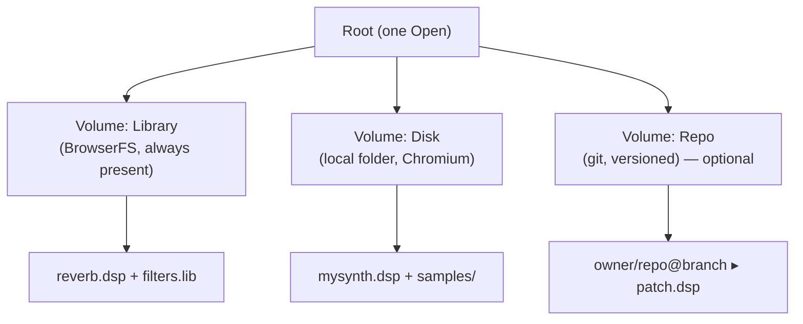

# Filesystem improvement plan — volumes, origin, and loss-free save

This document is the working plan for evolving Faust IDE's file management toward
the desktop-like model described in the markpage *Filesystem Blueprint*
(`FILESYSTEM-BLUEPRINT.pdf` at the repo root; source:
`markpage/docs/FILESYSTEM-BLUEPRINT.en.md`). It is written to be driven one phase
at a time by a contributor and/or an AI agent, under the rules of
[`AGENTS.md`](../AGENTS.md): characterize first, small reversible steps, tests and
docs in the same change, the gate green at every commit.

It is **a plan, not an implementation**. Nothing here changes behavior until a
phase is picked up. Each phase is shippable and individually green.

> **Operational companion.** For the precise, commit-by-commit execution — files,
> signatures, lifted functions, tests, risks, and doc cadence — see
> [`doc/filesystem-porting-plan.md`](filesystem-porting-plan.md). This file is the
> *what/why*; that one is the *how*.

> **How to read this.** §1–§4 are the *what* and *why* (give them to an agent as
> context). **§4b is the user-facing view** — today's experience vs. the new one,
> and the Chrome local-filesystem case (read this to understand the transition
> for the user). §5 is the module map and **§5b the concrete reuse map** — which
> markpage source files to lift from, and how. §6 is the ordered recipe (each
> phase names what to lift). §7–§9 are the Faust-specific details, pitfalls, and
> open decisions.

> **The markpage source is available** at `/Users/letz/Developpements/markpage/src`
> and its filesystem layer is small, framework-free, and already factored exactly
> along the blueprint's anatomy. Most of the plumbing below is **portable code**,
> not a from-scratch build — §5b maps each role to the file that already
> implements it. Lift the *engineering*, re-skin the *domain* (Markdown+images →
> Faust `.dsp`+`.lib`+soundfiles; jQuery/Bootstrap/Monaco instead of vanilla/Vite).

---

## 1. Where we are today (audit)

Faust IDE already has a small filesystem stack. Naming it precisely is the
starting point, because most of the blueprint's "private FS" already exists here
under a different name.

**Storage tiers in use:**

| Tier | Backed by | Role today | Module |
| :-- | :-- | :-- | :-- |
| Compiler VFS | Emscripten `libFaust.fs()` (`TFileSystem`) | Transient view the Faust compiler reads from | `model/ProjectModel.ts` |
| Durable project | BrowserFS/ZenFS, flat at `/` | Survives reloads; mirrored into the VFS on boot | `runtime/ProjectPersistence.ts` |
| Settings | `localStorage` (`faust_editor_*`) | Compile options, params, factory cache | `runtime/EditorSettingsStore.ts` |

**The project model today:**

- A single, implicit project: one **flat** directory (`PROJECT_DIR =
  /usr/share/project/`) of `.dsp` / `.lib` / soundfiles, with **one** "main" DSP
  file (`ProjectModel.mainFileIndex`).
- Filenames are sanitized to `[a-zA-Z0-9_.]`; no subfolders.
- `ProjectModel` owns the pure rules (list/create/rename/delete/select/main);
  `FileManager` owns the DOM; `ProjectPersistence` keeps BrowserFS and the VFS in
  sync.

**Operations today:**

- *New / Rename / Delete* (hard `unlink`, no trash), *Set main*, *Select*.
- *Import*: `ProjectFilesController` reads a browser `File` (drag-drop or hidden
  `<input>`) and always **copies** it into the project (`fileManager.newFile`).
- *Export*: ZIP of the whole project (`ProjectFilesController.saveZip`), or a
  faustservice upload (`ExportService` — `/filepost` returns a **content SHA**).
- *Share*: a URL carrying **one** file's code as base64 `inline=`
  (`ShareUrlService`).
- *Persist*: BrowserFS flat dir, reloaded into the VFS at startup.

**Two content-addressed stores already exist here.** This matters: the blueprint
flags content-addressed/immutable backends as a special case, and we have two of
them — the faustservice SHA (`ExportService.uploadAndPrecompile`) and the
self-contained `inline=` share payload. Their `(reuse)` caveats (§2, §4 of the
blueprint) apply directly to us, not just hypothetically.

### Gaps vs. the blueprint

1. **No volumes, no unified *Open*.** There is one implicit project, not a root
   of mountable volumes.
2. **No local-disk volume.** No File System Access API (`showDirectoryPicker`),
   no persisted handles in IndexedDB.
3. **No remote volume.** No versioned repo/cloud, no conditional write, no
   conflict detection, no fork-on-divergence.
4. **No origin.** Files don't *belong* to a volume; save is an implicit autosave
   to BrowserFS. There is no *Save As (volume, folder, name)*.
5. **No format-driven open.** Import always copies; nothing "opens in place".
6. **No trash.** Delete is a hard `unlink`.
7. **Flat namespace.** No folders, no tree browsing.
8. **Share/export are not a closed perimeter.** Share carries one file; the
   `.lib` files a `.dsp` imports and the soundfiles it references are not
   travelled as a unit (export partially does this — see §7).
9. **No external-change detection.** No mtime/ETag polling.

The good news: the existing durable project (BrowserFS) **is** the blueprint's
private-FS "Library" volume. We can adopt the blueprint as a **UX + thin data
layer over what exists** (the blueprint's "Path A", §8), rather than a rewrite.

---

## 2. Vocabulary, mapped to Faust IDE

Fix this language before any code; it is the preamble for an agent.

| Blueprint term | Meaning here |
| :-- | :-- |
| **Root** | The single *Open* surface listing all volumes. New; today there is none. |
| **Volume** | A browsable tree behind one storage engine. First volume = **Library** (the current BrowserFS project, wrapped). Later: **Disk** (a local folder), optionally **Repo** (a git remote). |
| **Mount** | Attaching a volume and **persisting** the attachment (disk handles → IndexedDB; repo coords → localStorage). |
| **Document** | The edited unit: a `.dsp`/`.lib` with *committed* content (last save) and a *working copy* (editor buffer). |
| **Origin** | The one volume a document was opened from; *Save* rewrites there. |
| **Perimeter** | A `.dsp` **plus its closure**: the project-local `.lib` files it `import("…")`s (transitively) and the soundfiles it `soundfile("…")`s. See §7. |

**Content-addressed caveat (applies to us).** The faustservice SHA and the
`inline=` share are content-addressed: an edit yields a *new* identity, never an
in-place rewrite. So for those backends the **origin lives in app state bound to
the current editing session and is reset on Open/New** — it cannot live on a
document record. And because Faust IDE compiles on an explicit **Run/submit**,
the "committed content" is the last submitted code, not every keystroke. This
mirrors the blueprint's `(reuse)` notes verbatim.



---

## 3. Invariants (these are the acceptance criteria)

**I1 — One namespace.** A single *Open* lists the volumes and descends them.
"Import from disk" stops being a separate command; it becomes *Open* of a foreign
format, or *Open a file…* in the same dialog.

**I2 — Volume = (root, backend), mount persisted.** Unmounting is **forbidden
while a document from that volume is open** (don't orphan a live origin).

**I3 — Single origin, edit in place.** A document belongs to the volume it came
from; *Save* rewrites there. For content-addressed targets, origin lives in
session state (§2).

**I4 — Open in place, or import a copy — decided by format.** A **native** Faust
file (`.dsp`, `.lib`) opens **in place**. A **foreign** file (`.txt`, anything
else; soundfiles are resources, handled as part of a perimeter) is **copied** into
the Library. "Import" is therefore not a command — it is *Open* of a foreign
format.

**I5 — Save = (volume, path).** *Save As* picks `(volume, folder, name)`.
"Linking to a repo/disk" disappears: linking is just saving elsewhere. On a
content-addressed store, *Save As a copy* only yields a new identity when the
content differs; a real copy/rename needs a path-based volume (Library, Disk).

**I6 — No data loss, ever** (for any versioned/remote volume):

- **Verbatim** — write the document byte-for-byte, not a re-serialization.
- **Closed perimeter** — publish the `.dsp` *and* its computed closure together
  (§7), atomically.
- **Divergence → non-destructive fork** — if the origin moved on its side, write
  a new `foo-<sha>.dsp` and re-link; never overwrite. Detection is by version
  identity (git sha / ETag), never by content diffing.

---

## 4. Operations (target behavior)

**Open.** The unified browser lists the root → the chosen volume's tree.
Native format → open in place (that volume becomes origin). Foreign → copy into
Library. The same dialog offers **"Open a file…"** (device file outside any
volume) via `showOpenFilePicker` on Chromium, falling back to `<input
type=file>` everywhere — **do not gate that button on File System Access**, or
Safari/Firefox lose all file input.

**Save / Save As.** *Save* commits the working copy and, if there is an origin,
rewrites it (conditional for remotes). *Save As* picks a new `(volume, folder,
name)`; this is also how you "publish" to a remote.

**Remote-save state machine** (the no-loss proof — every cell keeps both versions
or modifies none):

| Edited locally? | Origin moved ahead? | Transition |
| :-- | :-- | :-- |
| no | no | No-op |
| no | yes | Reload (fast-forward in) |
| yes | no | Fast-forward (push) |
| yes | yes | **Fork** (`foo-<sha>.dsp`, never overwrite) |

**Reload / Unlink / Delete.** *Reload* = manual pull from origin. *Unlink* =
drop the origin, leave backend content intact. *Delete* = permanent project
delete: remove the Library copy and forget any origin for that project name.

---

## 4b. The user's experience — today vs. tomorrow (and the Chrome case)

This section is the human-facing view: what changes for the person using Faust
IDE, written so a non-implementer can follow it. The guiding principle is
**continuity** — the common case must not get heavier, and **nothing the user has
today is lost** when the new model ships.

### 4b.1 How it works today

Faust IDE has **one implicit project** and no notion of *where* files live:

- The left **"Project Files"** panel lists a **flat** set of files (`.dsp`,
  `.lib`, soundfiles). One is the **main** DSP (the star).
- You **add** a file (`+`), **rename** it inline, **delete** it (`×`), or **set
  main** (star). You **drag-and-drop** a file onto the panel/editor, or click
  **Upload**, to bring a file in — always as a **copy**.
- Edits are **autosaved** to invisible browser storage (BrowserFS). There is **no
  Save button for your project** and no "where is this stored?" — reopen the tab
  and your project is just there.
- **Output** happens through three one-way exits: **Save** downloads a `.zip` of
  the whole project, **Share** makes a URL with *one* file's code inlined, and
  **Export** sends the project to the Faust service for native targets.

Mental model: *"there is one project; it lives in my browser and saves itself; I
can drop single files in and download a zip out."* There is no Open dialog, no
folders, no history, and **no way to keep the work as real files on the machine**.

### 4b.2 What changes — the new model

The new model keeps that easy path intact and adds a desktop-like spine on top:
a single **Open** surface, **places** (volumes) where files actually live, an
**origin** so *Save* knows where to write. Delete remains permanent and must
clear any associated origin immediately.

| Action | Today | Tomorrow |
| :-- | :-- | :-- |
| Find / start a project | Implicit single project | **Open** → pick a volume → pick a project/file |
| Bring a file in | *Upload* / drag → always a **copy** | **Open a file…** → native `.dsp`/`.lib` **opens in place**, foreign formats **copy** into the Library |
| Where it's stored | Invisible browser storage | A named **volume**: **Library** (browser), **Disk** (a real folder, Chrome), optionally **Repo** |
| Save | Autosave only | **Save** rewrites the **origin**; **Save As** picks `(volume, folder, name)` |
| Keep as real files | Only via a downloaded zip | **Save As → Disk** writes real files you see in Finder/Explorer (Chrome) |
| Delete | Hard, irreversible | Hard, irreversible; also clears any origin |
| Share / Export | Unchanged | Unchanged (still single-file share + faustservice export) |

**Concrete journeys:**

- **A — "Write a patch and hear it" (any browser).** Open the app; your last
  project is already there in the **Library**; edit; **Run**. *Identical to
  today* — the Library is the always-present, autosaving store. The new spine
  stays out of the way until you ask for it.
- **B — "Keep my work as real files" (Chrome).** *Open → Mount a disk folder →
  Save As there.* Your `.dsp` and its `.lib`s/soundfiles land as ordinary files
  in that folder — visible in Finder/Explorer, versionable with `git`, editable
  by other tools. Re-opening that file edits it **in place**; **Save** overwrites
  it on disk.
- **C — "Someone sent me a `.dsp`" / "it's in Downloads".** *Open → Open a file…*
  On Chrome from a mounted folder it opens **in place**; otherwise it opens as a
  **copy** in the Library. Replaces today's Upload-as-copy with one command.
- **D — "I deleted a file."** It is removed from the Library project and is not
  recoverable through the app. If the file came from a mounted disk origin,
  deleting the Library copy does **not** delete the disk file; it only unlinks
  the origin.

**Continuity guarantee.** On first launch of the new version, today's implicit
project **becomes a project in the Library** — same files, same autosave, nothing
to migrate by hand and nothing deleted. A user who never opens the new *Open*
dialog keeps exactly the current experience.

### 4b.3 The Chrome special case — a real local filesystem

Reading and writing **actual files on the user's machine** from a web page needs
the **File System Access API** (`showDirectoryPicker` / `showOpenFilePicker`),
which today is **Chromium-only**: **Chrome, Edge, Opera, Brave, Arc**. **Safari
and Firefox do not implement it.** This single browser fact is what splits the
experience — so the design **unifies the UX and degrades the capability**, never
the other way around.

**On Chromium — the "Disk" volume is unlocked:**

- The user picks a folder once; the app keeps a **directory handle** (persisted
  in IndexedDB) and the folder appears as a **Disk** volume in *Open*, browsable
  like any other.
- Files there are edited **in place**: *Save* writes the real bytes back to disk.
  This is what makes Faust IDE behave like a desktop app — files live where the
  user expects, survive outside the browser, and play nicely with `git` and other
  editors.
- **Permission lifecycle (important UX detail).** The handle survives a tab
  reload, but the **read-write permission does not** — after a reload the Disk
  volume shows a **"needs permission"** state and a single **click re-grants** it
  (the browser requires a user gesture). The background change-poller only ever
  *queries* permission silently; it never prompts. The user sees: *folder still
  mounted, one click to re-authorize.*

**On Safari / Firefox — graceful degradation, nothing removed:**

- There is **no Disk volume** (the browser forbids it), but the unified *Open*
  still works, and **"Open a file…" still works** via the classic
  `<input type=file>` picker. The difference: a file picked this way is a
  **read-only snapshot → copied into the Library** (the browser cannot write back
  to an arbitrary picked file). Output still flows through the unchanged **zip
  download / Share / Export** paths.
- **Critical rule (blueprint pitfall):** the **"Open a file…"** button must
  **never be gated** on File System Access being available — otherwise Safari and
  Firefox would lose all file input. It is always shown; only its *consequence*
  (in-place vs. copy) depends on the browser.

**Capability matrix:**

| Capability | Chrome / Edge / Brave / Arc | Safari / Firefox |
| :-- | :-- | :-- |
| Library (browser project) + autosave | ✅ | ✅ |
| Open a file… | ✅ (writable handle → can open **in place**) | ✅ (`<input>` → **copy** into Library) |
| Mount a **Disk** folder, edit in place, Save to disk | ✅ | ❌ (not offered) |
| Zip download / Share URL / faustservice Export | ✅ | ✅ |
| Repo volume *(optional Phase 8)* | ✅ | ✅ (REST, browser-independent) |

The takeaway for the user: **everyone gets the same dialog and the same Library;
Chrome users additionally get live local files.** A Safari/Firefox user is never
shown a broken or disabled-looking feature — the Disk option simply isn't present,
and an in-app hint can explain that opening a folder needs a Chromium browser.

### 4b.4 How the interface changes — controls, panels, modal

Concretely, in the current DOM (`src/static/index.html`): the left column
(`#left`) holds the **"Project Files"** panel (`#filemanager`) and a toolbar
(`#btns`) with **Run**, **Export** (default target, `#btn-def-exp`), **Share**,
**Upload** (`#btn-upload`), **Save As** (`#btn-save` — today a zip download),
**Docs**, and **Export** (truck, `#btn-export`). Share and Export already open
Bootstrap modals (`#modal-share`, `#modal-export`). The changes are **additive and
surgical** — most controls keep their place; two change meaning, one is added.

**Control-by-control:**

| Element (today) | Change | New behavior |
| :-- | :-- | :-- |
| `#filemanager` "Project Files" panel | **Kept; gains a header action + origin line** | Still lists the open project's files (`+` / rename / set-main stay). Header gains an **Open** button (folder icon) that launches the volume browser. A small **origin line** under the title shows where the project lives (e.g. `Library` or `Disk ▸ ~/patches`), with a sync hint for Disk/Repo. |
| Per-file **delete** (`×`) | **Hard delete** | Removes the Library project file and clears any origin/write-back link for that project name. |
| **Upload** (`#btn-upload`) | **Repurposed → "Open"** | Becomes the entry to the unified **Open** browser; the old "pick one file and copy it in" survives as **"Open a file…"** *inside* that browser (native picker on Chromium, `<input>` fallback elsewhere). |
| **Save As** (`#btn-save`, today = zip download) | **Repurposed → real Save As** | Opens the browser in **save mode** to pick `(volume, folder, name)`. The plain **zip download** does not disappear — it moves under Export/“Download .zip”. |
| *(none today)* | **New: Save** | An explicit **Save** (Ctrl/Cmd-S) that rewrites the **origin**. For a Library origin it stays effectively autosave (a confirming no-op); for a Disk/Repo origin it writes the perimeter back. |
| **Run / Share / Docs / Export (truck)** | **Unchanged** | Same buttons, same modals. |

**The new modal — the unified volume browser.** A third modal alongside
`#modal-share` / `#modal-export`, built the same way (Bootstrap overlay + SCSS, or
ported vanilla — open decision #6). It has: a **breadcrumb** (`root ▸ volume ▸
folders`), a **list pane** with loading / empty / error states (volumes are
async), an **"Open a file…"** action, and **mount actions** in the footer
(**"Mount a disk folder…"**, and **"Add a repository…"** if Phase 8 ships). In
**save mode** it adds a **name field + "Save here"** button. This is exactly
`ui/volume-browser.ts` (§5b), re-skinned without its former trash actions.

**Origin & permission indicators (new, small).** Near the file-manager header:
the **origin** (volume + path) and, for Disk/Repo, a state chip — `synced`,
`needs permission` (one click to re-authorize, Chromium after a reload), or
`diverged` (the origin moved; offer Reload/Fork). These are the only genuinely new
persistent widgets; everything else is inside the modal.

**Browser-conditional UI (the Chrome case, visually).** On Chromium the volume
browser shows the **"Mount a disk folder…"** action and lists mounted **Disk**
volumes at the root. On Safari/Firefox that action is **absent** (not greyed —
absent), replaced by a one-line hint ("Opening a folder on this device needs
Chrome/Edge"); **"Open a file…" is always present** on every browser.

**Left column, before → after (sketch):**

```
TODAY                              TOMORROW
┌─ Project Files          + ┐      ┌─ Project Files     [Open] + ┐
│  ● reverb.dsp            │       │  Library ▸ (origin)  ◍ synced │
│    filters.lib           │       │  ● reverb.dsp               │
│    kick.wav              │       │    filters.lib              │
├───────────────────────────┤      │    kick.wav    (× delete)   │
│ Run  Export  Share        │      ├──────────────────────────────┤
│ Upload  SaveAs  Docs  🚚  │      │ Run  Export  Share           │
└───────────────────────────┘      │ Open  Save  SaveAs  Docs  🚚 │
                                    └──────────────────────────────┘
        (Upload→Open ; SaveAs→pick (volume,folder,name) ; +Save ; +origin line)
```

**The volume browser modal (sketch):**

```
┌ Open ───────────────────────────────────────── × ┐
│ root ▸ Disk ▸ patches                             │
│ ┌───────────────────────────────────────────────┐ │
│ │ 📁 ..                                          │ │
│ │ 📄 reverb.dsp           (native → open in place)│ │
│ │ 📄 notes.txt            (foreign → copy to Lib) │ │
│ │ 🗀 samples/                                     │ │
│ └───────────────────────────────────────────────┘ │
│ [ Open a file… ]      [ Mount a disk folder… ]*   │   *Chromium only
└───────────────────────────────────────────────────┘
   (save mode adds:  name: [ mysynth.dsp ]  [ Save here ] )
```

---

## 5. Anatomy — modules to create/extend

Respecting the existing boundaries (`AGENTS.md`): pure rules in `src/model/`,
DOM-free logic in `src/runtime/`, DOM in `src/ui/`. Names are suggestions.

| Role | Responsibility | Module |
| :-- | :-- | :-- |
| **Volume interface** | `id/kind/label`, `state()`, `list(path)`, `readText(path)`; one adapter per backend | `src/runtime/fs/Volume.ts` (types) |
| **Library adapter** | Wrap today's BrowserFS project as the always-present private volume | `src/runtime/fs/LibraryVolume.ts` (over `ProjectPersistence`) |
| **Disk adapter** | File System Access; persisted handle; `needs-permission` state | `src/runtime/fs/DiskVolume.ts` |
| **Repo adapter** *(optional)* | REST + Git Data API; atomic blob→tree→commit→ref; conditional | `src/runtime/fs/RepoVolume.ts` |
| **Mount registry** | mount/unmount, persist (handles → IndexedDB, repos → localStorage), `listVolumes()` | `src/runtime/fs/MountRegistry.ts` |
| **Perimeter closure** | Parse `import("…")` + `soundfile("…")`, resolve project-local closure | `src/model/Perimeter.ts` |
| **Origin state** | Current document's origin (volume+path) or content-addressed session origin | `src/runtime/state/OriginState.ts` |
| **Remote sync** *(optional)* | Blob sha on raw bytes, 2×2 state machine, fork-on-divergence | `src/runtime/fs/RemoteSync.ts` |
| **Unified browser** | Modal: root → volume → folders; open/save modes; "Open a file…" | `src/ui/VolumeBrowserController.ts` |
| **Orchestration** | Wire Open/Save/Reload/Unlink, origin indicator, polling | `src/index.ts` (wiring only) + existing controllers |

Minimal volume interface to reproduce (illustrative TypeScript):

```ts
interface Volume {
  readonly id: string;
  readonly kind: "library" | "disk" | "repo";
  readonly label: string;
  state(): Promise<"ready" | "needs-permission" | "offline" | "error">;
  list(path: string): Promise<VolumeEntry[]>; // "" = root
  readText(path: string): Promise<string>;
  // writes go through the document/save layer, not here
}
interface VolumeEntry {
  name: string;
  path: string;             // relative to volume, no leading "/"
  type: "file" | "dir";
  isNative: boolean;        // .dsp/.lib → open in place; else → import (I4)
}
```

Reuse, don't duplicate: `LibraryVolume` should delegate to `ProjectModel` /
`ProjectPersistence`; `FileManager` stays the Library's tree view; `ExportService`
and `ShareUrlService` are the content-addressed "save" paths and should be
described by this model, not replaced.

---

## 5b. Reuse map — what to lift from `markpage/src`

markpage's filesystem layer is ~8 small modules that already implement this
blueprint. Three categories: **port** (lift almost verbatim — domain-agnostic),
**adapt** (the structure transfers, the domain logic is rewritten for Faust), and
**reference** (we already have an equivalent; read for shape only).

| markpage file | What it is | For us | Notes |
| :-- | :-- | :-- | :-- |
| `volumes.ts` | `Volume`/`VolumeEntry` types + `LibraryVolume`/`DiskVolume`/`RepoVolume` adapters + pure helpers `childrenFromTree`, `sortEntries` | **Port** (types + helpers + Disk/Repo); **adapt** Library | Rename `isMarkdown`→`isNative` (`.dsp`/`.lib`). `childrenFromTree`/`sortEntries` are pure → unit-test verbatim. `LibraryVolume` rewires to `ProjectPersistence` instead of `docs.ts`. |
| `volume-registry.ts` | mount/unmount + persistence (disk handles → IndexedDB with `isSameEntry` idempotency; repo coords → localStorage); `listVolumes()` | **Port verbatim** | Just rename DB/keys (`markpage-volumes`→`faust-volumes`, etc.). The `isSameEntry` "already mounted" check and the `disk:`/`repo:` id scheme are exactly what Phase 3 needs. |
| `disk-link.ts` | File System Access wrappers: `fsAccessAvailable`, `pickDirectory`, `pickImportableFileHandle`, `ensureRwPermission`, **`queryRwGranted`** (query-only, for the silent poller), handle persistence, **mtime baseline** (`saveSyncedMtime`/`loadSyncedMtime`), single-file & bundle I/O | **Port**, re-skin the bundle | Keep the FS-Access + handle-persistence + mtime machinery as-is. Replace the `content.md` + `assets/<sha>.<ext>` **bundle layout** with a Faust perimeter written under real names (`main.dsp` + `*.lib` + soundfiles). |
| `ui/volume-browser.ts` | The unified browser modal: root→volume→folders, open/save modes, "Open a file…", breadcrumb, loading/empty/error, `needs-permission` re-auth on click | **Port the logic; re-skin the chrome** | It's framework-free DOM and maps 1:1 to our `VolumeBrowserController`. Decide: keep vanilla DOM, or rebuild on Bootstrap modal + SCSS to match faustide (open decision #6). Replace `t()` i18n + `makeIcon` with our strings/icons; do not port markpage's trash actions. |
| `github.ts` | Thin GitHub REST + **Git Data API** client (blob→tree→commit→ref), `getTreeRecursive`, **`gitBlobSha`** (git SHA on **raw bytes**), token in IndexedDB | **Port verbatim** *(Phase 8 only)* | Fully pure over `fetch` (unit-testable by mocking `globalThis.fetch`). `gitBlobSha` on bytes (not strings) is the anti-overwrite key — note the `"é".length===1` but 2-byte caveat in its docstring. |
| `github-sync.ts` | The **I6 engine**: `saveToGithub` 2×2 state machine (No-op/Reload/Fast-forward/**Fork**), atomic commit with **422-retry that re-evaluates**, fork-path hash-lengthening, `importFromGithub` | **Port; swap the perimeter** *(Phase 8 only)* | The only Faust coupling is the resource closure: replace `extractExternalRefs`/`resolveRepoPath` (Markdown image refs) with our `import`/`soundfile` closure (§7). The state machine, retry loop, and fork logic transfer unchanged. |
| `resource-mapping.ts` | Markdown ref scanner: `extractExternalRefs`, `rewriteExternalRefs`, **`opaqueCodeRanges`** (mask code-fences + inline-code so refs inside literals are ignored) | **Adapt — this is the template for `Perimeter`** | The *technique* is what transfers: scan for refs, **mask comments/strings** before matching. For Faust, mask `//` line + `/* */` block comments and string literals, then match all four primitives: `import("…")` / `library("…")` / `component("…")` / `soundfile("…")`. markpage's SHA-pool + `img://` rewriting is **not** needed for the Library (we keep real filenames); it only resurfaces when bundling to disk/repo with collision avoidance. |
| `opfs.ts` | Origin Private File System helpers (the markpage private-FS backend) | **Reference only** | We already have the private FS (BrowserFS via `ProjectPersistence`). Read `opfs.ts` for the path-based-helper shape if we ever migrate off BrowserFS (open decision #1); otherwise skip. |
| `image-store.ts` | SHA-keyed blob pool (content-addressed image store) | **Reference only** | Faust soundfiles live as named project files, not a SHA pool. Only relevant if disk/repo bundling adopts content-addressed dedup. |

**One structural difference to design around.** markpage is a **single-document**
app: the open unit is one `.md`, and its images are an *internal substrate*; the
Library volume therefore lists **documents**. Faust IDE is a **multi-file
project** app: the open unit is a *project* (a main `.dsp` + its `.lib`s and
soundfiles), and that whole project **is** the blueprint's "Document + perimeter".

Consequence for the Library adapter: faustide's `LibraryVolume` should list
**projects**, not loose files — each project a folder/bundle in BrowserFS. Opening
a project loads its perimeter into the flat working dir that today's `FileManager`
already renders. In other words: **`FileManager` becomes the open project's
working view; the `VolumeBrowser` becomes the project chooser / *Open*.** This is
the multi-project upgrade of today's single implicit project, and is captured as
open decision #5. (If we choose to keep one implicit project, `LibraryVolume`
instead lists that project's files and the Library "root" is the current file
manager — simpler, but less of a desktop-like *Open*.)

---

## 6. Recipe — ordered, each phase shippable and green

> **Verification caveat (state it in every PR that touches pickers).** The File
> System Access / `<input type=file>` pickers **cannot be driven headless**.
> Unit-test the pure parts (listing helpers, perimeter closure, bundle
> serialization, feature gating); the pick → write → read flows are **verified by
> hand in a real Chromium**. An agent must **not** claim it tested those flows.
> Add the manual steps to the checklist in `doc/refactor-plan.md`.

Each phase below ends green under the `AGENTS.md` gate (`npm test`,
`npm run test:unit`, `npm run build`; e2e when browser-visible) and updates
`doc/refactor-plan.md` and `doc/testing.md` as required.

**Phase 0 — Frame it.** *(this document)* Vocabulary + invariants captured.
Everything refers back here. No code.

**Phase 1 — Volume interface + Library adapter.** Define `Volume`/`VolumeEntry`
and a `LibraryVolume` that wraps the **existing** BrowserFS project (the
"always-there", no-permission origin). Pure listing helpers fully unit-tested. No
UI change yet — this is a non-behavioral seam.
*Lift:* `volumes.ts` — the `Volume`/`VolumeEntry` types and `sortEntries`
verbatim; model `LibraryVolume` on markpage's but back it with
`ProjectPersistence`/`ProjectModel`. Rename `isMarkdown`→`isNative`.
*Verify:* unit tests of `list("")` / `readText` against the in-memory fake FS.

**Phase 2 — Origin as session state.** Introduce `OriginState`: the current
document's origin. For the Library it's `(volume=library, path)`; reset on
New/Open. Wire `FileManager` selection to set it. No persistence, no new backend.
*Verify:* selecting a file sets origin; New resets it.

**Phase 3 — Mount registry.** mount/unmount + persist + `listVolumes()`. Library
is auto-mounted and **unremovable**. Handles → IndexedDB (never JSON), repo
coords → localStorage. Forbid unmounting a volume with an open document (I2).
*Lift:* `volume-registry.ts` almost verbatim — the IndexedDB disk-handle store
with the `isSameEntry` idempotency check, the `disk:`/`repo:` id scheme, and
`listVolumes()`. Rename the DB/storage keys to a `faust-*` namespace.
*Verify:* a mount survives a tab reload (e2e); Library always present.

**Phase 4 — Unified browser (open mode).** One modal: root (volumes) → tree.
Loading/empty/error states (async-ready). Esc / click-outside / breadcrumb. For
now it can open from Library only.
*Lift:* `ui/volume-browser.ts` — port its navigation/render logic (root render,
breadcrumb, loading/empty/error, `enterVolume` re-auth). Re-skin the chrome to
Bootstrap/SCSS or keep vanilla (decision #6); swap `t()`/`makeIcon` for ours.
*Verify:* navigation + states via Playwright; replaces nothing destructive yet.

**Phase 5 — Format-driven open + "Open a file…" (I4).** Native (`.dsp`/`.lib`)
→ open in place; foreign → copy into Library. Add **"Open a file…"**
(`showOpenFilePicker` → `<input>` fallback, **not** gated on FSA). This unifies
today's drag-drop/`<input>` import in `ProjectFilesController` under one command.
*Lift:* `disk-link.ts` — `fsAccessAvailable` and `pickImportableFileHandle`
(Chromium picker) verbatim; keep `ProjectFilesController`'s existing `<input
type=file>` reader as the fallback. Route in-place vs copy by extension.
*Verify (manual):* foreign file lands as a Library copy; native opens in place.

**Phase 6 — Disk volume + Save As (I5).** `DiskVolume` via File System Access;
persisted handle; `needs-permission` re-grant on a click after reload. *Save As*
picks `(volume, folder, name)`; absorbs any notion of "link to disk". Bundle a
`.dsp` with its perimeter (Phase 7) when saving to disk.
*Lift:* `volumes.ts` `DiskVolume`, `volume-registry.ts` `mountDisk`, and
`disk-link.ts` (`pickDirectory`, `ensureRwPermission`, `queryRwGranted`,
`saveHandle`/`loadHandle`, `saveSyncedMtime`/`loadSyncedMtime`). Re-skin
`writeBundleToDir`/`readBundleFromDir` from `content.md`+`assets/<sha>` to the
Faust perimeter under real filenames.
*Verify (manual):* create in Library, *Save As* to a disk folder, confirm files
in the OS file manager; reload → re-grant flow works.

**Phase 7 — Perimeter closure (I6 verbatim + closed perimeter).** `Perimeter`
parses all four Faust file-pulling primitives — `import("X.lib")`,
`library("X.lib")`, `component("X.dsp")` (transitively, project-local only —
**not** bundled stdfaust libs) — and `soundfile("name", n)` references, returning
the file set that travels with a `.dsp`. Make *Save As to disk*, the project ZIP
(`ProjectFilesController.saveZip`), and the faustservice export
(`ExportService.buildProjectZip`) all use this **computed** closure instead of
"all files" / "all .lib + .wav". See §7.
*Lift:* `resource-mapping.ts` as the template — reuse the `opaqueCodeRanges`
masking approach (mask code/comments before matching) and the
extract/rewrite-pair shape; rewrite the matchers for Faust's four primitives.
Skip its SHA-pool/`img://` rewriting (not needed for the Library).
*Verify:* unit tests on the parser (imports, nested imports, missing files,
soundfiles, comment/string edge cases).

> **Sequencing note.** The porting plan executes P7 **before** P6 so that
> P6's disk-bundle writer can call `computeClosure` from the start. The feature
> numbering follows the blueprint anatomy (7 = perimeter, 6 = disk), not the
> implementation order.

**Phase 8 — Remote repo + sync engine (I6 fork).** *Optional / advanced.*
`RepoVolume` + `RemoteSync`: blob sha on **raw bytes**, atomic
blob→tree→commit→**conditional** ref; on divergence write `foo-<sha>.dsp` and
re-link — never overwrite. Implement the 2×2 machine (§4). Poll sha/ETag on
focus + interval (no file-watching). A PAT held in the browser (localStorage *or*
IndexedDB) is XSS-exposed: use a **fine-grained, single-repo, short-lived** token
and say so in the UI.
*Lift:* `github.ts` (Git Data API client + `gitBlobSha` on raw bytes + token
store) verbatim, and `github-sync.ts` (`saveToGithub` 2×2 machine, 422-retry,
fork-path hash-lengthening) with only the perimeter swapped to §7's closure.
Both are pure over `fetch` → unit-test by mocking `globalThis.fetch`. Note:
markpage stores the PAT in **IndexedDB**, not localStorage — prefer that.
*Verify (manual):* edit the same origin from two tabs → divergence must fork.

**Phase 9 — Delete/origin cleanup.** Keep delete permanent and make it safe
under mounted-file origins. One delete path removes the Library project file,
updates selection/main-file state, and forgets any disk origin for that project
name. Startup prunes persisted origins whose project file is no longer present.
*Lift:* none from markpage's trash UX; its restore/purge/empty actions are
outside this target model.
*Verify:* deleting a mounted file removes the green indicator and write-back
origin; reloading after delete does not resurrect stale tracking for a new
same-named local file.

> **Cross-cutting (keyboard).** Faust IDE uses Monaco, not contentEditable, so the
> Firefox `Ctrl/Cmd`-bubbling trap is less acute — but `GlobalShortcutsController`
> binds on `window`. If new shortcuts (Save/Open) are added, bind them in the
> Monaco keymap too and guard the global handler with `if (e.defaultPrevented)
> return`.

### Recommended slice

Phases **0–7 + 9** deliver the desktop-like UX (volumes, origin, format-driven
open, disk Save As, closed-perimeter export/share, safe permanent delete)
**without** standing up a git backend. Phase **8** (remote repo) is genuinely larger (auth, tokens,
conflict UX) and is marked optional — pick it up only if a remote story is
actually wanted. This realizes the blueprint's advice: **aim for Path B as the
mental model, ship via Path A**, and say the debt out loud so "link" and
"ownership" don't get confused.

---

## 7. Faust-specific: the perimeter

The blueprint is explicit that the perimeter is **project-specific** and must be
**computed**, not assumed — and it names our exact case: "the `.lib` files a
`.dsp` pulls in". Concretely, the closure of a Faust main file is:

- **File-pulling primitives** (all four must be scanned, transitively):
  - `import("X.lib")` — pull a `.lib` by library path.
  - `library("X.lib")` — pull a `.lib` and bind it to a name.
  - `component("X.dsp")` — embed another DSP file.
  - `soundfile("name", channels)` — reference a project-local audio file.
  
  Include only **project-local** files — **exclude** the bundled standard
  libraries (`stdfaust.lib` and the libs it re-exports), which the compiler
  resolves from its own libraries dir and which must not be duplicated into a
  bundle.
- Parse carefully: ignore matches inside line/block comments (`//`, `/* */`) and
  string literals other than the primitive argument itself.

Today this closure is approximated in two places and should be unified behind
`Perimeter`:

- `ExportService.buildProjectZip` ships **all** `.lib` + **all** `.wav`/`.flac`,
  plus a generated main — an over-approximation.
- `ProjectFilesController.saveZip` ships **every** project file — also an
  over-approximation.

Replacing both with the computed closure makes I6's "closed perimeter" real and
keeps disk/remote bundles minimal and correct.

---

## 8. Pitfalls checklist (carry into every relevant phase)

- **Non-serializable handles** → IndexedDB (structured clone), never JSON.
- **RW permission re-requested after reload** → model a `needs-permission` state,
  re-grant on a click.
- **"Open a file…" not gated** on File System Access (keep the `<input>`
  fallback), or Safari/Firefox lose import.
- **A picked file is not a volume** → unify the UX, not the plumbing.
- **Remote writes always conditional** + divergence → fork, never overwrite.
- **No file-watching** → poll mtime/sha/ETag on focus + interval.
- **Import that always copies** → route by format; a native file opens in place.
- **Content-addressed origin** lives in session state, reset on Open/New (§2).
- **Don't break the contract surface** (`AGENTS.md`): preserve the
  `window.faustEnv` shape and the `faust_editor_*` localStorage keys; keep
  services DOM-free; keep diffs minimal and characterize before moving code.

Engineering lessons embedded in the markpage code (carry them when porting):

- **Git blob SHA on raw bytes, never a string** (`gitBlobSha`): `"é".length===1`
  but is 2 UTF-8 bytes — hashing the string silently breaks verbatim (I6/R1).
- **Conditional write + 422-retry that re-evaluates** (`saveToGithub`): on a
  rejected fast-forward, re-read the head and re-run the whole No-op/Reload/FF/Fork
  decision; don't just retry the same write.
- **Idempotent mount on the folder identity** (`mountDisk` via `isSameEntry`):
  re-picking the same directory reuses its mount id instead of duplicating it.
- **Query vs. request permission are different calls** (`queryRwGranted` vs
  `ensureRwPermission`): the background poller must *query only* (no gesture, stay
  silent); only a user click may *request* a re-grant.
- **Mask code/comments before scanning refs** (`opaqueCodeRanges`): length-aware
  fence matching so refs inside literals aren't collected or rewritten — the same
  discipline our Faust `import`/`soundfile` parser needs.
- **Fork by lengthening a content hash, never an ordinal** (`forkPath`,
  `nameWithHash`): collisions resolve deterministically and idempotently.

---

## 9. Open decisions (resolve before the affected phase)

1. **Private-FS backend — keep BrowserFS or move to OPFS?** The blueprint
   recommends OPFS; we already run BrowserFS/ZenFS. Recommendation: **keep
   BrowserFS** behind `LibraryVolume` (no rewrite); revisit OPFS only if a
   concrete limitation appears. *(Affects Phase 1.)*
2. **Is a remote (git) volume in scope at all?** Phase 8 is large. Default:
   **defer** unless a sharing/versioning story is explicitly wanted. *(Affects
   Phase 8.)*
3. **Folders in the Library — flat or nested?** Today flat. Nested folders touch
   `ProjectModel`, `FileManager`, and the export/share paths. Default: **stay
   flat** in the Library; let Disk/Repo volumes expose their real tree. *(Affects
   Phases 4, 6.)*
4. **Share URL vs. the perimeter.** `inline=` carries one file. Do we extend
   sharing to a perimeter (e.g. multi-file payload), or keep single-file share
   and route multi-file through ZIP/disk/repo? Default: **keep `inline=`
   single-file**, treat real multi-file sharing as a Repo/Disk concern. *(Affects
   Phase 7.)*
5. **Library lists projects, or one project's files?** markpage's Library lists
   *documents* because it is single-document; faustide is multi-file (a project =
   main `.dsp` + perimeter). Recommendation: **Library lists projects** (each a
   BrowserFS bundle), `FileManager` becomes the open project's working view — the
   real desktop-like *Open*. Cheaper alternative: keep today's single implicit
   project and have the Library list its files. *(Affects Phases 1, 4, 9 — see the
   structural note in §5b.)*
6. **Volume browser — port vanilla DOM, or rebuild on Bootstrap?** `ui/volume-
   browser.ts` is framework-free. Porting it as-is is fastest; rebuilding it on
   faustide's Bootstrap modal + SCSS is more consistent with the existing UI.
   Recommendation: **port the logic, re-skin the chrome** to match. *(Affects
   Phase 4.)*

> **On "sharing".** As the blueprint notes, "shared" is not a separate primitive
> — it is a property of a remote volume (several devices opening the same origin).
> This plan promises **loss-free conflicts** (I6), **not** real-time
> collaboration. Don't let the UI imply otherwise.

---

## References

- [`doc/filesystem-porting-plan.md`](filesystem-porting-plan.md) — the operational,
  commit-by-commit execution plan (steps, tests, risks, doc cadence).
- `FILESYSTEM-BLUEPRINT.pdf` (repo root) — the source blueprint.
- **markpage source** `/Users/letz/Developpements/markpage/src` — the reference
  implementation. Most relevant files (see §5b): `volumes.ts`,
  `volume-registry.ts`, `disk-link.ts`, `ui/volume-browser.ts`, `github.ts`,
  `github-sync.ts`, `resource-mapping.ts`, `opfs.ts`.
- [`doc/refactor-plan.md`](refactor-plan.md) — architecture + phase status; update
  it as phases land.
- [`doc/testing.md`](testing.md) — test architecture; extend when new
  helpers/specs introduce a pattern.
- [`AGENTS.md`](../AGENTS.md) — the contributor contract this plan must satisfy.
